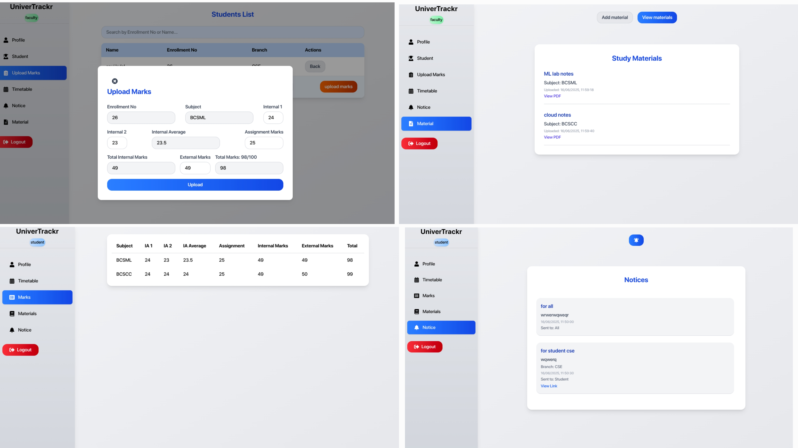
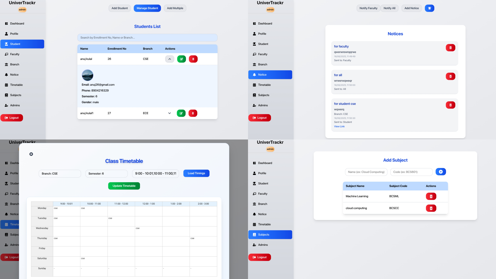

# UniverTrackr

A full-stack web application for managing college operations, including students, faculties, branches, subjects, notices, study materials, marks, and timetables.

## Features

- **Role-based Dashboards:** Separate interfaces for Admin, Faculty, and Student.
- **Student Management:** Add, edit, view, and list students.
- **Faculty Management:** Add, edit, view, and list faculties.
- **Branch & Subject Management:** Manage branches and subjects.
- **Notice Board:** Admin can notify all users or specific roles; users can view notices.
- **Marks Management:** Faculties can upload/edit marks; students can view their marks.
- **Study Material:** Faculties can upload materials; students can view/download them.
- **Timetable:** Admin/faculty can upload/edit timetable; students can view their timetable.
- **Authentication:** Secure login for all roles.

## Tech Stack

- **Frontend:** React, TypeScript, Tailwind CSS, Axios
- **Backend:** Node.js, Express.js, MongoDB, Mongoose
- **Authentication:** JWT, bcrypt
- **File Uploads:** Multer
- **Charts:** Chart.js (react-chartjs-2)
- **Other:** Redux (for state management), Framer Motion (for animations)

## Getting Started

### Prerequisites

- Node.js (v16+)
- MongoDB

### Installation

1. **Clone the repository:**
   ```bash
   git clone https://github.com/anujkulal/UniverTrackr.git
   cd UniverTrackr
   ```

2. **Install dependencies for backend and frontend:**
   ```bash
   # Backend
   cd backend
   npm install

   # Frontend
   cd ../frontend
   npm install
   ```

3. **Set up environment variables:**

   - Create a `.env` file in the `backend` directory with the following:
     ```
     MONGO_URI=mongodb://localhost:27017/univertrackr
     JWT_SECRET=your_jwt_secret
     PORT=5000
     ```

4. **Run the backend server:**
   ```bash
   cd backend
   npm run dev
   ```

5. **Run the frontend app:**
   ```bash
   cd frontend
   npm run dev
   ```

6. **Access the app:**
   - Open [http://localhost:5173](http://localhost:5173) in your browser.


## Usage

- **Admin:** Manage all entities, send notices, view analytics.
- **Faculty:** Manage students, upload marks/materials, view timetable.
- **Student:** View marks, notices, study materials, and timetable.

## Screenshots




## Contributing

Pull requests are welcome! For major changes, please open an issue first to discuss what you would like to change.
